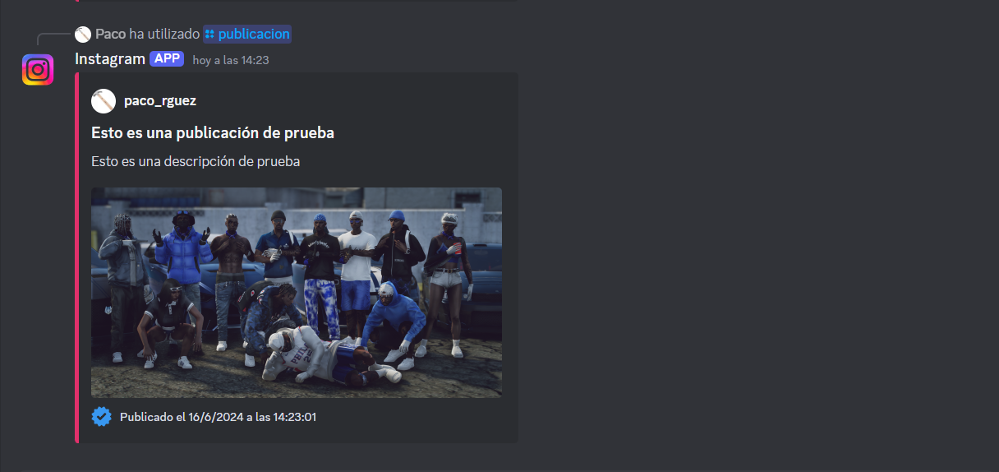

# Discord Instagram Bot

Este es un bot de Discord que imita publicaciones de Instagram usando comandos slash.



## Características

- Crea publicaciones con título, descripción, imagen y localización opcional.
- Añade la fecha y hora de la publicación.
- Incluye el nombre de usuario y avatar del autor en el embed.

## Instalación

1. Clona el repositorio:
    ```sh
    git clone https://github.com/tu-usuario/discord-instagram-bot.git
    cd discord-instagram-bot
    ```

2. Instala las dependencias:
    ```sh
    npm install
    ```

3. Crea un archivo `.env` en la raíz del proyecto con el siguiente contenido:
    ```plaintext
    TOKEN=your_discord_bot_token
    CLIENT_ID=your_discord_client_id
    GUILD_ID=your_discord_guild_id
    CHANNEL_ID=your_discord_channel_id
    ```

    ```plaintext
    • TOKEN: El token de tu bot de Discord. Puedes obtenerlo desde el Portal de Desarrolladores de Discord al crear una nueva aplicación y un bot.

    • CLIENT_ID: El ID del cliente (aplicación) de tu bot. También se obtiene del Portal de Desarrolladores de Discord.

    • GUILD_ID: El ID del servidor (guild) de Discord donde deseas que el bot funcione. Puedes obtenerlo haciendo clic derecho en el servidor en Discord y seleccionando "Copiar ID" (asegúrate de tener activado el Modo Desarrollador en Discord).
    
    • CHANNEL_ID: El ID del canal específico donde quieres que el bot envíe las publicaciones. Puedes obtenerlo haciendo clic derecho en el canal en Discord y seleccionando "Copiar ID".
    ```

4. Inicia el bot:
    ```sh
    node index.js
    ```

## Uso

Utiliza el comando `/publicacion` en Discord para crear una nueva publicación de Instagram.

## Contribución

Las contribuciones son bienvenidas. Por favor, abre un issue o un pull request para discutir cualquier cambio que te gustaría realizar.

## Soporte y Contacto

Si quieres contactar conmigo puedes hacerlo a través de Discord enviando una solicitúd de amistad. Mi usuario: paco_rguez
